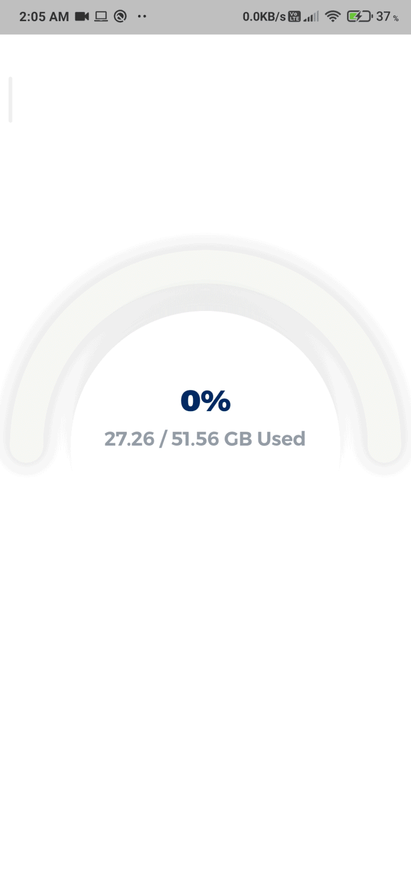

# Multi Circular Slider

[](https://pub.dev/packages/multi_circular_slider)

A highly customizable progress bar for Flutter which helps showing multiple values in single progress bar with different 
colors and also animate it for you.



## Getting Started

- [Installation](#installation)
- [Basic Usage](#basic-usage)
- [MultiCircularSlider parameters](#multicircularslider-parameters)

### Installation

Add

```
dependencies:
  multi_circular_slider: ^latest_version
```

to your `pubspec.yaml`, and run

```bash
flutter packages get
```

in your project's root directory.

### Basic Usage


Import it to your project file

```dart
import 'package:multi_circular_slider/multi_circular_slider.dart';
```

And add it in its most basic form like it:

```dart
MultiCircularSlider(
    size: MediaQuery.of(context).size.width * 0.8,
    values: [0.2, 0.1, 0.3, 0.25],
    colors: [Color(0xFFFD1960), Color(0xFF29D3E8), Color(0xFF18C737), Color(0xFFFFCC05)],
    showTotalPercentage: true,
),

```

There are additional optional parameters one can initialize the slider with.

```dart
MultiCircularSlider(
    size: MediaQuery.of(context).size.width * 0.8,
    values: [0.2, 0.1, 0.3, 0.25],
    colors: [Color(0xFFFD1960), Color(0xFF29D3E8), Color(0xFF18C737), Color(0xFFFFCC05)],
    showTotalPercentage: true, // to display total percentage in center
    label: 'This is label text', // label to display below percentage
    animationDuration: const Duration(milliseconds: 500), // duration of animation
    animationCurve: Curves.easeIn, // smoothness of animation
    innerIcon: Icon(Icons.integration_instructions), // to display some icon related to text
    innerWidget: Text('96%'), // to show custom innerWidget (to display set showTotalPercentage to false)
    trackColor: Colors.white, // to change color of track
    progressBarWidth: 52.0, // to change width of progressBar
    trackWidth: 52.0, // to change width of track
    labelTextStyle: TextStyle(), // to change TextStyle of label
    percentageTextStyle: TextStyle(), // to change TextStyle of percentage
);
```

### MultiCircularSlider parameters

| Parameter | DataType | Default Value | Description |
| ------ | ------ | ------ | ------ |
| size | Size | | the space widget should take up on screen |
| values | List<double> | | pass different percentages you want to show which sum up to 1.0 or less |
| colors | List<Color> | | different colors which you want to give to the progress bars (NOTE: length of `values` & `colors` should be same) |
| showTotalPercentage | bool | true | whether to show total percentage in center or not |
| label | String | | any label text which you want to show below total percentage |
| animationDuration | Duration | Duration(milliseconds: 500) | the duration you want for the animation |
| animationCurve | Curve | Curves.easeInOutCubic | the curve you want for animation |
| innerIcon | Widget | | the icon which you can display above the total percentage text |
| innerWidget | Widget | | the widget you want to show inside the circular progress bar (NOTE : innerWidget will only de displayed if showTotalPercentage is false) |
| trackColor | Color | Colors.grey | color of the track of progressBar |
| progressBarWidth | double | 32.0 | stroke width of the progressBar |
| trackWidth | double | 32.0 | stroke width of the progressBar track |
| labelTextStyle | TextStyle | | TextStyle which you want to give to label |
| percentageTextStyle | TextStyle | | TextStyle which you want to give to percentage |
